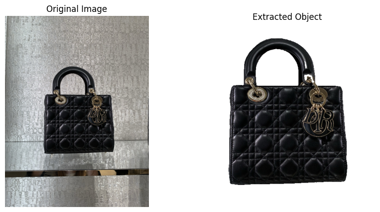
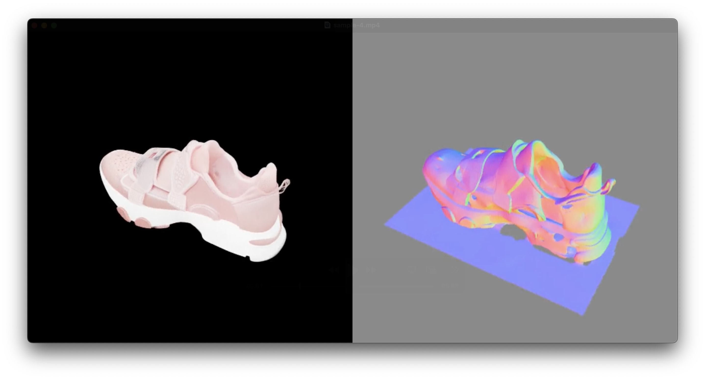

# Dior Product Classification

## Overview

The **Dior Product Classification** project aims to accurately match product images taken in-store with their corresponding reference images in the DAM dataset. With a dataset comprising over **2700 DAM images** (one per Dior product) and **80 manually labeled test images**, the goal is to develop a robust system that can identify the correct DAM image for a given shop-taken photo.

Given the limited number of test images and the complexity of the dataset, various approaches were explored, including Siamese Neural Networks, Autoencoders, and Vision Transformer (ViT) fine-tuning. The most effective results were achieved using the `embedding_similarity_search.ipynb` notebook, which leverages advanced techniques like background removal, feature extraction with Google ViT Large Patch16 224, 3D data augmentation using TRELLIS, and FAISS-based similarity search.

## Features

- **Image Preprocessing**: Background removal using RMBG-2.0 to enhance feature extraction.
- **Feature Extraction**: Utilizes Google ViT Large Patch16 224 for generating high-quality image embeddings.
- **Similarity Search**: Implements FAISS for efficient and scalable similarity searches across the DAM dataset.
- **3D Data Augmentation**: Enhances data diversity using TRELLIS for generating 3D models and multiple renderings.
- **Web Interface**: Interactive Gradio application for real-time image similarity searches.
- **Optimization**: Employs gradient descent for optimizing feature aggregation and selection coefficients.

## Installation

Ensure you have **Python 3.8** or higher installed. Install the required dependencies using the following commands:

```bash
pip install -r requirements.txt
```

Download the `data` directory from the [Hugging Face Hub](https://huggingface.co/datasets/louisgthier/dior-dam-dataset) and place it in the project root.

## Directory Structure

```plaintext
├── embedding_similarity_search.ipynb  
├── siamese_neural_network.ipynb  
├── autoencoders.ipynb  
├── vit_finetuning.ipynb  
├── app.py  
├── benchmarks  
├── data  
│   ├── DAM  
│   └── test_image_headmind  
├── labels  
│   └── handmade_test_labels.csv  
├── utils  
│   ├── preprocessing  
│   ├── models  
│   │   ├── base_model.py  
│   │   ├── dinov2_model.py  
│   │   ├── facebook_vitmsn_model.py  
│   │   ├── google_vit_model.py  
│   │   ├── microsoft_resnet_model.py  
│   │   ├── openai_clip_model.py  
│   │   ├── fashion_clip_model.py  
│   │   └── nomic_embed_vision_model.py  
│   ├── generate_3d_models_modal.py  
│   └── render_glb_images.py  
├── .cache  
│   ├── embeddings  
│   ├── coefficients  
│   └── faiss  
└── README.md
```

## Usage

### 1. Running the Gradio Demo

Launch the interactive Gradio web application to perform image similarity searches.

```bash
python app.py
```

Alternatively, you can run it using Gradio directly:

```bash
gradio app.py
```


### 2. Preprocessing and Feature Extraction

Run the main notebook `embedding_similarity_search.ipynb` to preprocess images, extract features, and build the FAISS index.

```bash
jupyter notebook embedding_similarity_search.ipynb
```



### 3. Deploy TRELLIS for 3D Data Augmentation

Before generating 3D models, deploy TRELLIS on Modal by following the instructions in the [TRELLIS Modal Deployment Repository](https://github.com/louisgthier/trellis-modal-deployment).

Run the 3D generation script to create 3D models using TRELLIS.

```bash
python utils/generate_3d_models_modal.py
```

### 4. Rendering 3D Models with Blender

Use the `utils/render_glb_images.py` script to render images from `.glb` files.

```bash
python utils/render_glb_images.py
```

  


## Scripts Overview

- **embedding_similarity_search.ipynb**: Main notebook for preprocessing, feature extraction, and building the FAISS index.
- **siamese_neural_network.ipynb**: Notebook exploring Siamese Neural Network approaches.
- **autoencoders.ipynb**: Notebook experimenting with Autoencoder architectures.
- **vit_finetuning.ipynb**: Notebook focused on fine-tuning Vision Transformer models.
- **app.py**: Gradio-based web application for demonstrating the image similarity search functionality.
- **utils/preprocessing/**: Contains utilities for image preprocessing, including background removal.
- **utils/models/**: Implements various vision models used for feature extraction.
- **utils/generate_3d_models_modal.py**: Script for generating 3D data augmentation using TRELLIS.
- **utils/render_glb_images.py**: Script for rendering `.glb` files into images using Blender.

## Performance

- **Model**: Google ViT Large Patch16 224
- **Top-1 Accuracy**: 45%
- **Top-3 Accuracy**: 59%
- **Top-5 Accuracy**: 64%

## Benchmarking

Benchmark results are saved in the `benchmarks` directory in JSON format. Each benchmark file includes Top-1, Top-3, and Top-5 accuracy metrics.

## Contributing

Contributions are welcome! Please fork the repository and submit a pull request for any enhancements or bug fixes.

## License

This project is licensed under the MIT License. See the [LICENSE](LICENSE) file for details.

## Acknowledgements

- [Google ViT](https://github.com/google-research/vision_transformer)
- [FAISS](https://github.com/facebookresearch/faiss)
- [TRELLIS Modal Deployment](https://github.com/louisgthier/trellis-modal-deployment)
- [Gradio](https://gradio.app/)
- [RMBG-2.0](https://github.com/briaai/RMBG-2.0)