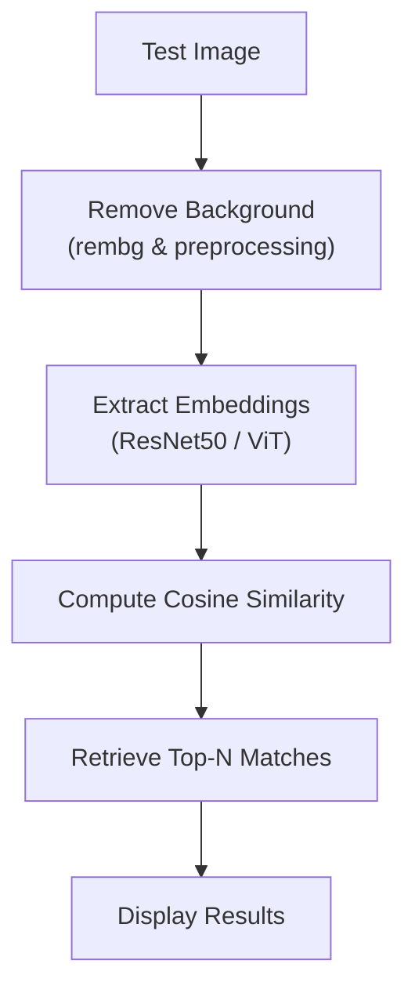

```mermaid
flowchart TD
    A[Test Image] --> B["Remove Background
    (rembg & preprocessing)"]
    B --> C["Extract Embeddings
    (ResNet50 / ViT)"]
    C --> D[Compute Cosine Similarity]
    D --> E[Retrieve Top-N Matches]
    E --> F[Display Results]
```